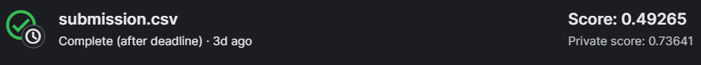

# Test task for internship in R&D Winstars AI
# Airship bus detection with U-Net
## Solution
## Preprocessing 
Firstly i drop images, that have size under size_threshold = 50 kb(it can be changed with settings.json). Then i crop images 3x3 and take, part where an amount of ships was the biggest, and train on it my neural network. Also i have feature 'has_ship', to use more images with ships, because data is highly imbalanced, also i trained not on a full data, because i have small amount of time, but only on data, that consists of 1000 images without ships and 15000 images with ships. Also in deployment part this params can changed in `settings.json`. My solution also includes Augmetation techniques, but provided model was trained with them, they are provided like dict in `settings.json`  
## Loss 
For training loss i used combination of Binary crossentropy loss and (1-Dice score), becauese BCE penalizes differences in pixel values between the predicted and true segmentation masks and the complement of the Dice score (1 - Dice score) penalizes discrepancies in segmentation overlap. By combining BCE and Dice Loss, i create a loss function that aims to minimize both pixel-wise differences and segmentation overlap discrepancies simultaneously. This can lead to more accurate and robust segmentation models, particularly in tasks where both aspects are important.
## Model 
I used only default U-net architecture with [16,32,64,128] number of filters. Also this model is very small about 5 Mb, and gave pretty good results, despite of fact, that it was trained only on a part of data and for 10 epochs.
## Callbacks
I used, pretty default callbacks, such like ModelCheckpoint to save best weigths with minimal `val_loss`, ReduceLROnPlateau to to adjust the learning rate during training to optimize the learning process and improve convergence, and EarlyStopping to stop the training process early if a monitored metric stops improving.
## Results
On validation metrics, i got about 0.6 dice_score. And on submission results, i got 0.73 IoU on private dataset(93% of test_data) and 0.49 on public.

I think, it is very good results, because my model is baseline, and i have no time to finetune and try different better architecture and ideas.

## Possible improvements
Due lack of time, i have tried only baseline, but also i wanted to try, to experiment with another encoders block, for example use pretrained ResNet, or XCeption as encoder block, also i wanted to try another architecures like Mask R-CNN, but it would be even more time consuming for training,  and also Fine-Tuning. Also, i wanna try to make image-classifier, that classifies image has ship or not, to have higher performance in deployment stage. Firstly run classifier, and don't run segmentation model on empty image, can give more performance, and have lower execution time. It is worth to add, that experiments and creating more deeper architecture based on base U-Net with more number of filters, layers, adding more Regularization Techniques also can give even more better results, but took time.

# Deploy stage(scripts)
## Prescription
I tried to make deploy version mostly to can create experiments with out much changes in coding, so most parametrs are dependend from `settings.json`, alls paths, model compilation params, augmenation params and etc, can be changes there.

### Setting Up Development Environment

To set up your development environment, follow these steps:

1. **Install Python 3.9**: If you haven't already, download and install Python 3.9 from the [official Python website](https://www.python.org/downloads/release/python-3916/). Ensure that you select the appropriate installer for your operating system.

2. **Download Visual Studio Code (VSCode)**: VSCode is an excellent IDE for Python development. You can download it from the [official website](https://code.visualstudio.com/Download).

3. **Install VSCode**: After downloading the installer, follow the installation instructions provided for your operating system. Once installed, open VSCode.

4. **Open Workspace**: Navigate to the directory where you have cloned the forked repository for your project. In VSCode, go to the `File` menu and click `Add Folder to Workspace`. Select the directory where your project resides and add it to the workspace.

5. **Configure Python Interpreter**: In VSCode, open the command palette by pressing `Ctrl + Shift + P` (or `Cmd + Shift + P` on macOS) and type `Python: Select Interpreter`. Choose Python 3.9.x from the list of available interpreters.

6. **Start Coding**: VSCode provides various features such as syntax highlighting, code completion, and debugging configurations for Python development. You can now edit files, navigate through your project, and start contributing to your project.

7. **Running Scripts**: To execute Python scripts, open a new terminal in VSCode by selecting `Terminal -> New Terminal` from the menu. Navigate to the directory where your Python script is located and run it using the `python` command followed by the script filename.

With Python 3.9.x installed and your development environment configured in VSCode, you're all set to begin coding and contributing to your project. Happy coding!

## Data Loading 
I created DataLoading script, that downloads competition data with kaggle api, but if you wanna use it, you need to provide your api-credentials, in folder `src/api-keys/kaggle.json`. But their api is also very unstable and while testing, i had much times, that they abort connection, and downloaded zip archive was corrupted. Also i tried some another ways to download smaller amount of data, but kaggle provides only 2 methods to download all data, or download only one file. I tried to download one by one smaller amount of images, but it creates too many requests, so it also aborts connections. But, anyway i created functionality, that you connect just provide path to your data folder(<b>but it must be in the same format like on kaggle, or you must change responsible params in `settings.json`</b>)  
To run script use bash from root folder of project
```bash
python src/data_process/data_loader.py 
```
## Data processing
I provide most details in solution part. 
To run script use 

```bash
python src/data_process/data_processor.py --path <your_kaggle_data_dir_path>
```
Instead of <your_kaggle_data_dir_path> provide your path, or by default it will be `./data/kaggle_data`. There must be `train_ship_segmentations_v2.csv` or change name in `settings.json` in ['processing']['input_df_name']

## Training 
It took pretty much time to train on CPUs, i tried to include switch on GPU, and it can works for you, but it requires another compiled version of tensorflow. But i trained model in kaggle notebook with TPU, and just download it.
To run training script use:
```bash
python src/train/train.py --path <your_kaggle_data_dir_path>
```
With <your_kaggle_data_dir_path> provide your data folder in kaggle format, or by default it will be `./data/kaggle_data`. Also all names must be same to kaggle competion, or you will need to change them in `settings.json`
Modelcheckpoints(Weights) you can find in `./outputs/models_checkpoints`
## Inference 
Inference on full data can took time, so i added parameter to run it only on a part of test data. (And running on full data on a week machine(like mine) can throw some errors and ends earlier, because of running out of memory). 

To run inference script use:

```bash
python src/inference/inference.py --data_path <your_kaggle_data_dir_path> --model_weights_path <model_weights_path> --amount <amount>
```
With <your_kaggle_data_dir_path> provide your data folder in kaggle format, or by default it will be `./data/kaggle_data`. Also all names must be same to kaggle competion, or you will need to change them in `settings.json`. By the default <model_weights_path> it will takes my pretrained model from `scr/model_weigths/best_baseline.hdf5`. <amount> is integer amount of test data, on which you wanna test inference.

## Overview
It was very interesting experience, and i have learned and tried many new things, but don't have much time to implement in practice. But i wanna say thank you for this opportunity, and will looking forward for results.